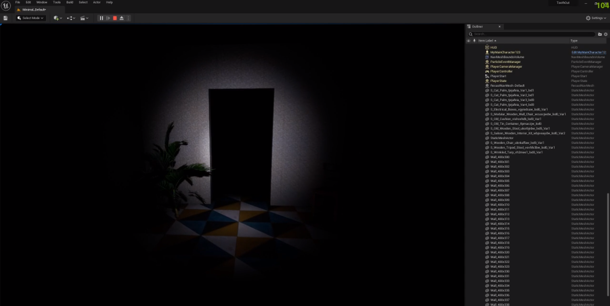

# Teeth Out
Игра от первого лица в жанре хоррор, разработанная небольшим студенческим коллективом на движке Unreal Engine 5.

Наша команда:
- Павленко Арсений
- Фроллов Максим
- Санников Владимир
- Фомин Александр

Игра разрабатывалась как дипломный проект по курсу "Алгоритмизация и программирование Python/C++"

## Как запустить

Поскольку игра является студенческим проектом и предназначена только для домашнего использования, для запуска необходимо склонировать данный репозиторий на локальное устройство.
Следующим шагом необходимо скачать Unreal Engine 5. Это можно сделать бесплатно в приложении Epic Games Launcher. После скачивания игрового движка нужно открыть в нём проект, который вы склонировали из данного репозитория и запустить.

## Сюжет

## Описание игрового процесса

